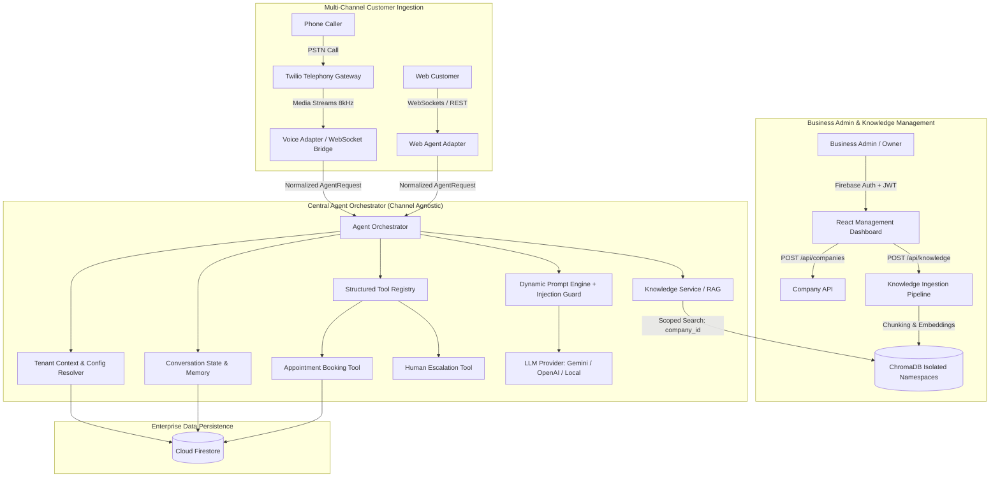
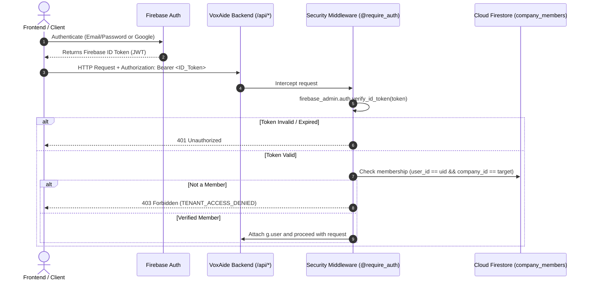

# VoxAide AI — Target System Architecture & Technical Specification

**Document Version:** 2.0.0 (Phase D Core Implementation)  
**Date:** September 2026  
**Status:** Implemented & Verified  

---

## 1. Architectural Philosophy

VoxAide is built as a **modular, multi-tenant AI customer support platform**.
The core architectural mandate is the strict decoupling of **Telephony / Audio Transport** from the **Central Agent Orchestrator**. 

The reasoning engine, knowledge retrieval (RAG), and business tools do not know whether a customer is typing in a web playground, speaking via WebRTC, or calling from a standard cellular phone via Twilio PSTN.



---

## 2. Multi-Tenant Data Isolation Model

Every business customer operates within a logically isolated tenant namespace identified by a unique `company_id`.

```
                    ┌────────────────────────┐
                    │      Company A         │
                    │ id: cmp_smilecare_001  │
                    └───────────┬────────────┘
                                │
        ┌───────────────────────┼───────────────────────┐
        ▼                       ▼                       ▼
┌──────────────┐        ┌──────────────┐        ┌──────────────┐
│ Agent Config │        │ Conversations│        │ Vector Chunks│
│ Name: Maya   │        │ & Turn Logs  │        │ company_id:  │
│ Persona: Pro │        │ company_id:  │        │ cmp_001 ONLY │
└──────────────┘        └──────────────┘        └──────────────┘
```

### 2.1 Enforced Tenant Isolation Rules
1. **Zero Blind Trust:** The backend never trusts a `company_id` supplied in request bodies or query parameters.
2. **Membership Verification:** Every protected endpoint invokes `@require_company_access("company_id")`, which validates that the authenticated Firebase UID is an active member or owner in the target company's `company_members` collection.
3. **Hard 403 Forbidden Rejection:** If User B attempts to access or execute an operation on Company A, the request is immediately rejected with HTTP 403 Forbidden (`TENANT_ACCESS_DENIED`).
4. **Data-Store Level Scoping:**
   - **Firestore:** Documents are partitioned under `companies/{company_id}` or stamped with `company_id`.
   - **Vector Engine (ChromaDB):** Every vector search applies a strict metadata filter: `where={"company_id": company_id}`.

---

## 3. Server-Side Authentication Flow

VoxAide utilizes **Firebase Authentication** on the client side and verifies ID tokens server-side using the **Firebase Admin SDK**.



---

## 4. Central Agent Orchestrator Architecture

The `AgentOrchestrator` is the unified conversational brain of VoxAide.

### 4.1 Orchestration Workflow
1. **Input Normalization:** Accepts `AgentRequest(company_id, message, conversation_id, user_id, channel)`.
2. **Context Resolution:** Loads the `Company` record and dynamic `AgentConfig` (greeting, tone, business hours, escalation policy).
3. **Conversation State:** Retrieves the last $N$ turns from `ConversationService` to provide short-term conversational context.
4. **RAG Knowledge Retrieval:** Invokes `KnowledgeService.search(company_id, query)`.
5. **Prompt Injection Defense:** Assembles the system prompt. System instructions and verified business knowledge are clearly delimited. Retrieved documents are labeled as untrusted reference data that cannot override core behavioral rules.
6. **Provider-Agnostic LLM Execution:** Calls `LLMProvider.generate()`.
7. **Business Tool Dispatch:** If the model requests function calls (e.g., `book_appointment`, `escalate_to_human`), the orchestrator dispatches execution to `ToolRegistry.execute()`. Crucially, `company_id` is automatically injected into the tool execution context.
8. **Memory Persistence:** Writes both user and assistant turns to Firestore.
9. **Structured Return:** Returns `AgentResponse(text, conversation_id, tool_calls, sources, should_escalate, latency_ms)`.

---

## 5. Provider Abstraction Architecture

VoxAide avoids vendor lock-in by wrapping external AI and storage services behind clean abstract base classes:

```text
voxaide-backend/app/providers/
├── base.py                   # Abstract LLMProvider, EmbeddingProvider, VectorStore
└── gemini_provider.py        # Concrete GeminiProvider (gemini-2.5-flash)
```

Swapping Gemini for OpenAI, Anthropic, or a self-hosted vLLM instance requires implementing a single class adhering to `LLMProvider` without altering a single line of `AgentOrchestrator` or business logic.

---

## 6. Structured Business Tool System

Tools represent real-world business actions. They are managed through `ToolRegistry`:

```python
class AgentTool(ABC):
    @property
    def name(self) -> str: ...
    @property
    def description(self) -> str: ...
    @property
    def parameters_schema(self) -> Dict[str, Any]: ...
    def execute(self, company_id: str, **kwargs) -> Dict[str, Any]: ...
```

Tools registered in Phase D:
- `EscalateToHumanTool`: Dispatches callback tickets or triggers call transfer when customers request human assistance or voice complex complaints.

---

## 7. Telephony & Future Voice Integration

As detailed in [docs/VOICE_ARCHITECTURE_RESEARCH.md](file:///e:/voxaide-main/docs/VOICE_ARCHITECTURE_RESEARCH.md), the telephony layer connects to this architecture via **Twilio Media Streams**:
- **PSTN Call Inbound:** Twilio hits `/api/twilio/voice` webhook.
- **WebSocket Gateway:** Twilio streams raw 8kHz μ-law audio to our voice adapter.
- **Streaming Bridge:** The adapter streams audio to Gemini Live or a cascaded STT engine, which translates audio turns into `AgentRequest` payloads for `AgentOrchestrator`.
- **Interruption / Barge-in:** When the caller interrupts the bot, the voice adapter flushes Twilio's audio buffer (`{"event": "clear"}`), ensuring sub-500ms conversational turn transitions.
