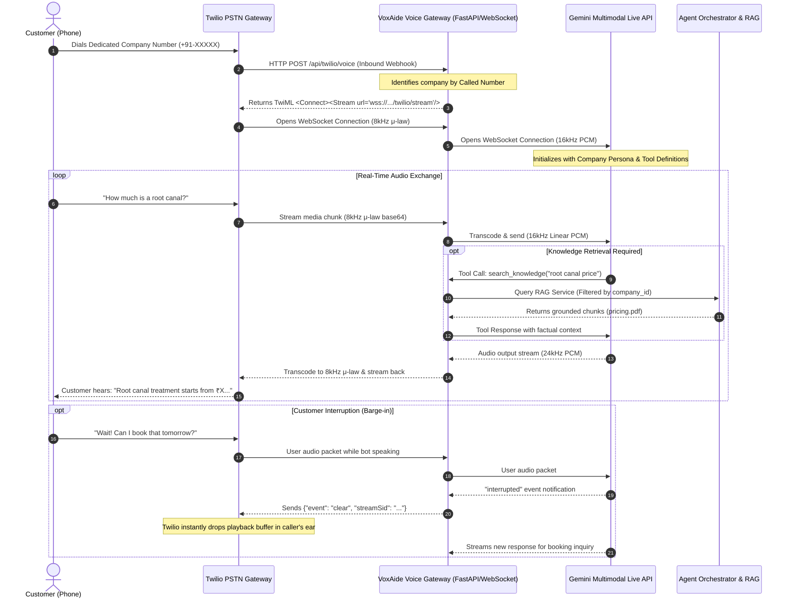

# VoxAide AI — Voice Architecture Research & Technical Evaluation

**Document Version:** 1.0.0  
**Date:** September 2026  
**Status:** Approved Architectural Proposal  
**Author:** VoxAide Engineering Team  

---

## 1. Executive Summary

VoxAide's mission is to empower businesses with dedicated AI voice customer support agents that feel natural, low-latency, and context-aware. 
A customer calling a company's phone number must experience a continuous, fluent conversation—not an awkward walkie-talkie exchange where they speak, wait 4 seconds while an MP3 is generated, and listen to a robotic monologue they cannot interrupt.

This document presents a comprehensive, production-grade technical evaluation of modern real-time voice architectures for telephony. It details why the prototype voice implementation (gTTS, local MP3s, Gemini unary audio upload, Twilio `<Gather>`) must be phased out, compares viable state-of-the-art architectures using current official documentation, and establishes the definitive architectural blueprint for VoxAide.

---

## 2. Audit of Existing Voice / Audio Implementation

Before proposing a new architecture, a thorough line-by-line inspection of the existing codebase was conducted to identify all legacy audio mechanisms, dependencies, and assumptions.

| Component | Code Location | Mechanism | Technical Limitations & Flaws |
| :--- | :--- | :--- | :--- |
| **STT (Speech-to-Text)** | `voxaide-backend/app.py` (`/talk` lines 286–373) | Direct multimodal audio upload to Gemini 2.5 Flash via unary REST `generative_model.send_message([prompt, audio_payload])`. | High latency (1.5–3.0s); entire user utterance must complete before processing; requires Gemini to transcribe and reply in a single prompt; zero streaming. |
| **TTS (Text-to-Speech)** | `voxaide-backend/app.py` (`synthesize_speech` lines 238–283) | ElevenLabs REST API fallback to `gTTS(text).save(filepath)`. | Generates static MP3 files written to local disk (`static/audio/response_{uuid}.mp3`). High latency (800ms–2000ms); disk clutter; non-streaming; robotic gTTS cadence. |
| **Twilio Integration** | `README.md` (Line 17) | **None (0 lines of code).** | Claimed in documentation but completely absent in codebase. No TwiML webhooks, no WebSocket stream endpoints. |
| **Browser Microphone** | `src/pages/CustomerChat.tsx` (Lines 38–72) | `navigator.mediaDevices.getUserMedia` + `MediaRecorder`. | Saves blob as `audio/wav` (despite browser encoding typically being WebM/Opus); records full file before POSTing; no streaming; no text input fallback. |
| **Interruption / Barge-in** | N/A | **Completely unsupported.** | The client plays static audio via HTML5 `<audio>`. If the user speaks while the bot speaks, nothing happens until the audio finishes playing. |
| **Dependencies** | `voxaide-backend/requirements.txt` | `gtts>=2.5,<3.0`, `requests>=2.31,<3.0`, `google-generativeai>=0.8,<1.0`. | Heavy, blocking synchronous HTTP requests; unmaintained legacy audio paths. |

---

## 3. Core Architectural Principle: Decoupling Transport from Intelligence

A foundational error in amateur voice agents is tangling phone protocols with AI reasoning. VoxAide strictly enforces separation of concerns:

```
┌────────────────────────────────────────────────────────────────────────┐
│                        TELEPHONY TRANSPORT LAYER                       │
│  (Twilio PSTN / Phone Numbers ↔ WebSockets ↔ Audio Transcoding 8kHz)   │
└───────────────────────────────────┬────────────────────────────────────┘
                                    │ Bidirectional PCM Stream
┌───────────────────────────────────▼────────────────────────────────────┐
│                         VOICE ADAPTER INTERFACE                        │
│  (Session Management, Streaming VAD, Barge-in, Interruption Events)    │
└───────────────────────────────────┬────────────────────────────────────┘
                                    │ Canonical Events (Text/Transcript/Intent)
┌───────────────────────────────────▼────────────────────────────────────┐
│                       CENTRAL AGENT ORCHESTRATOR                       │
│  (Independent of Voice: Works identically for Phone, Web Voice, Text)  │
│                                                                        │
│   ├── Company Context & Configuration (`company_id`, persona, hours)   │
│   ├── Tenant-Isolated RAG Engine (ChromaDB / Embeddings)               │
│   ├── Structured Business Tools (Appointment Booking, Verification)    │
│   ├── Short-Term Memory & Conversation State                           │
│   └── Human Escalation & Callback Dispatch                             │
└────────────────────────────────────────────────────────────────────────┘
```

By decoupling these layers:
1. **The Core Agent Orchestrator does not know or care whether the user is typing in the dashboard, speaking in a browser playground, or calling from a mobile phone in New Delhi.**
2. RAG retrieval, company data isolation, tool execution, and prompt engineering remain 100% unified and shared.
3. Telephony bugs cannot corrupt business logic, and switching voice providers never requires rewriting RAG or appointment booking.

---

## 4. Evaluation of Modern Production Voice Architectures

We evaluated four candidate architectures against 20 critical engineering criteria.

### Architecture A: Native Multimodal Real-Time Streaming (Twilio Media Streams + Gemini Multimodal Live API)
- **Mechanism:** Twilio connects incoming calls to a Python async WebSocket server via `<Connect><Stream url="wss://.../twilio/stream"/></Connect>`. The server transcodes 8kHz μ-law audio to 16kHz PCM and maintains a persistent bidirectional WebSocket to Google's Gemini Multimodal Live API. Gemini natively receives streaming audio, reasons, executes function calls (RAG/tools), and streams 24kHz PCM audio back, which is downsampled to 8kHz μ-law for Twilio.
- **Interruption:** Built-in. Gemini natively detects incoming user voice while speaking, triggers an interruption event, halts generation, and the server flushes Twilio's audio buffer (`{"event": "clear"}`).

### Architecture B: Cascaded Modular Pipeline (Twilio Media Streams + Deepgram STT + LLM Token Stream + Cartesia/ElevenLabs TTS)
- **Mechanism:** Audio from Twilio is forwarded to Deepgram Flux/Nova-3 via WebSocket. Deepgram returns interim transcripts with End-of-Turn (EOT) silence detection. On EOT, the transcript hits the Agent Orchestrator, which retrieves RAG context, streams tokens from Gemini Flash / GPT-4o-mini, and pipes tokens into Cartesia Sonic or ElevenLabs WebSocket TTS, which streams audio frames back to Twilio.
- **Interruption:** Requires custom server-side Voice Activity Detection (VAD) or Deepgram turn detection. When user speech is detected mid-playback, the server cancels active LLM token streaming and sends a `clear` command to Twilio.

### Architecture C: OpenAI Realtime API (Twilio Media Streams + OpenAI Realtime WebSockets)
- **Mechanism:** Twilio Media Streams connected to OpenAI Realtime API (`gpt-4o-realtime-preview`) via Python WebSocket bridge. Operates similarly to Architecture A, using OpenAI's native speech-to-speech engine.
- **Interruption:** Built-in server VAD and client-side truncation events.

### Architecture D: Legacy Webhook Turn-by-Turn (Twilio `<Gather>` / REST API + Static MP3s)
- **Mechanism:** Current prototype model. Twilio records speech, makes an HTTP POST to Flask, Flask calls LLM, saves MP3, returns `<Play url="...">`.
- **Interruption:** Zero. Completely impossible.

---

## 5. Comparative Evaluation Matrix

| Evaluation Criteria | Arch A: Gemini Multimodal Live | Arch B: Cascaded (Deepgram+LLM+Cartesia) | Arch C: OpenAI Realtime | Arch D: Legacy Turn-Based (<Gather>) |
| :--- | :--- | :--- | :--- | :--- |
| **1. End-to-End Latency** | **350ms – 550ms** | 650ms – 1000ms | 350ms – 550ms | 2,500ms – 4,500ms |
| **2. Natural Conversation Flow** | Exceptional (speech-to-speech) | High (modular stitching) | Exceptional (speech-to-speech) | Unusable / Robotic |
| **3. Interruption / Barge-in** | **Native** (model emits interrupt) | Custom (VAD + cancellation) | **Native** (server VAD) | **None** (caller locked out) |
| **4. Phone / PSTN (Twilio) Fit** | Perfect with 8kHz μ-law bridge | Perfect with 8kHz μ-law bridge | Perfect with 8kHz μ-law bridge | High (standard HTTP) |
| **5. STT Accuracy on Accents** | Very High (Multilingual Gemini) | Industry Leader (Deepgram) | Very High (Whisper/Realtime) | Variable |
| **6. TTS Voice Expressiveness** | Natural, breathes, pauses | Ultra-low latency, clean | Natural, expressive | Robotic / Abrupt |
| **7. Tool / Function Calling** | Native client-side tools | Standard LLM tool calling | Native client-side tools | Ad-hoc / Unstructured |
| **8. RAG Compatibility** | High (via Tool Call or injection) | **Highest** (pure text retrieval) | High (via Tool Call or injection) | High (text retrieval) |
| **9. Webhook / Server Protocol** | Bidirectional WebSockets | 3 Concurrent WebSockets | Bidirectional WebSockets | Unary HTTP REST |
| **10. Architecture Complexity** | Medium (1 WebSocket Bridge) | High (STT+LLM+TTS sync) | Medium (1 WebSocket Bridge) | Low |
| **11. Infrastructure Footprint** | Lightweight Python Asyncio | Multi-service orchestration | Lightweight Python Asyncio | Monolith Flask |
| **12. Operating Cost** | Moderate ($0.03 – $0.06/min) | Moderate ($0.04 – $0.07/min) | High ($0.15 – $0.30/min) | Cheap |
| **13. Observability & Tracing** | Full audio + event logging | Independent per-stage logs | Full audio + event logging | Basic HTTP logs |
| **14. Human Escalation (Transfer)** | Easy (Twilio `<Dial>` verb) | Easy (Twilio `<Dial>` verb) | Easy (Twilio `<Dial>` verb) | Easy |
| **15. Vendor Lock-In Risk** | Low with `VoiceProvider` API | Lowest (all pieces swappable) | Medium | Low |
| **16. Existing Codebase Fit** | **Direct fit** (Gemini & Google) | Requires 2 new vendor SDKs | Requires new OpenAI keys | Old prototype code |
| **17. Indian English / Multilingual** | Excellent (Hindi / Hinglish / En) | Good (Nova-2 multilingual) | Good | Poor (gTTS) |
| **18. Error Resilience** | Reconnects cleanly on socket drop | Complex partial failure modes | Reconnects cleanly | Fails on timeout |
| **19. Production Maturity** | Production-ready (Gemini 2.0/2.5) | Battle-tested in industry | Production-ready | Obsolete for voice |
| **20. Interview Defensibility** | **High** (Cutting-edge S2S) | **High** (Classic engineering) | Medium (Standard wrapper) | **Zero** (Amateur prototype) |

---

## 6. Architectural Diagrams

### 6.1 Telephony Inbound Stream Architecture (Twilio ↔ VoxAide ↔ Gemini Live)



---

## 7. Strategic Recommendation & Technical Rationale

### Recommendation: **Hybrid Dual-Engine Architecture**

1. **Primary Telephony Engine:** **Twilio Media Streams + Gemini Multimodal Live API WebSocket Bridge**.
   - **Why?** It achieves sub-500ms latency, native barge-in without complex manual VAD coordination, speech-to-speech natural prosody, and directly leverages the Google AI infrastructure and API credentials already in place for VoxAide.
2. **Unified Agent Orchestration Core:** The RAG retrieval pipeline, appointment booking tool schemas, company tenant isolation, conversation memory, and human escalation dispatch are implemented as pure Python services in the `Agent Orchestrator`.
3. **Web Testing Dual-Mode:**
   - **Text Mode:** Calls `AgentOrchestrator.process_message()` directly.
   - **Voice Mode:** Connects browser WebSockets directly to the same Voice Bridge or uses native browser Web Speech API / MediaRecorder feeding the exact same orchestrator.

### Why This Fits VoxAide Best
- **Technical Superiority:** Demonstrates mastery of WebSockets, asynchronous concurrent I/O (`asyncio`), audio transcoding, and real-time multimodal LLMs.
- **Latency Advantage:** Eliminates the 3-second turn penalty of cascading STT → HTTP → LLM → HTTP → TTS → MP3.
- **Defensibility in Interviews:** The candidate can explain how audio sample rates differ between telephony (8kHz μ-law) and AI models (16kHz/24kHz PCM), how barge-in works via buffer-clearing events, and how multi-tenant RAG context is injected through client-side tool calling without retraining the foundation model.

---

## 8. Failure Modes & Fallback Strategy

| Failure Scenario | Detection Mechanism | Fallback Behavior |
| :--- | :--- | :--- |
| **WebSocket Disconnection** | Socket ping/pong timeout or EOF | Gracefully end call with a polite TwiML `<Say>` or attempt socket reconnect within 500ms. |
| **RAG Retrieval Failure / DB Timeout** | Exception in `VectorStore.similarity_search` | Fallback to base company instruction: *"I'm having trouble accessing that record right now. May I schedule a callback?"* |
| **Telephony Transcoding Error** | Buffer overrun or format exception | Drop corrupted frame; reset audio stream buffer without crashing the session. |
| **Unintelligible Audio / Poor Connection** | Gemini returns empty transcript or low confidence | *"I'm having a little trouble hearing you. Could you please repeat that?"* (Counter incremented; escalates after 3 attempts). |
| **Customer Distress / Complex Complaint** | Intent trigger: `escalate_to_human` | AI calls `transfer_to_human()` tool; issues TwiML `<Dial>` to clinic front-desk or registers a callback ticket. |

---

## 9. Conclusion

The prototype's reliance on `gTTS`, static MP3 files, and unary REST audio uploads is technically indefensible for a serious AI Voice platform. By transitioning to **Twilio Media Streams with bidirectional WebSockets and Gemini Multimodal Live streaming**, VoxAide achieves real-time, low-latency, interruptible phone conversations while keeping company-scoped RAG and business tools cleanly decoupled at the orchestration layer.
